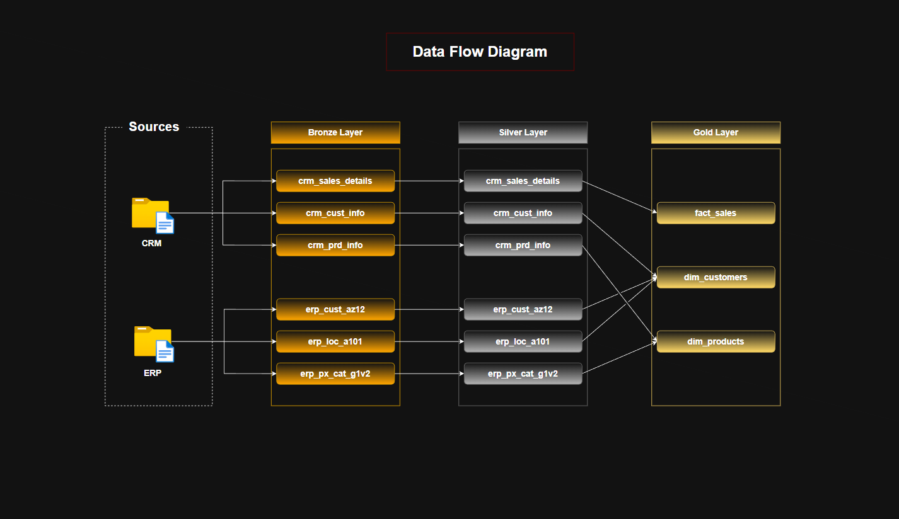
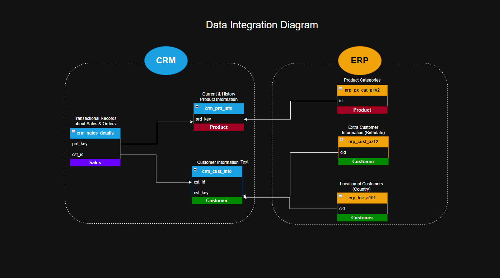
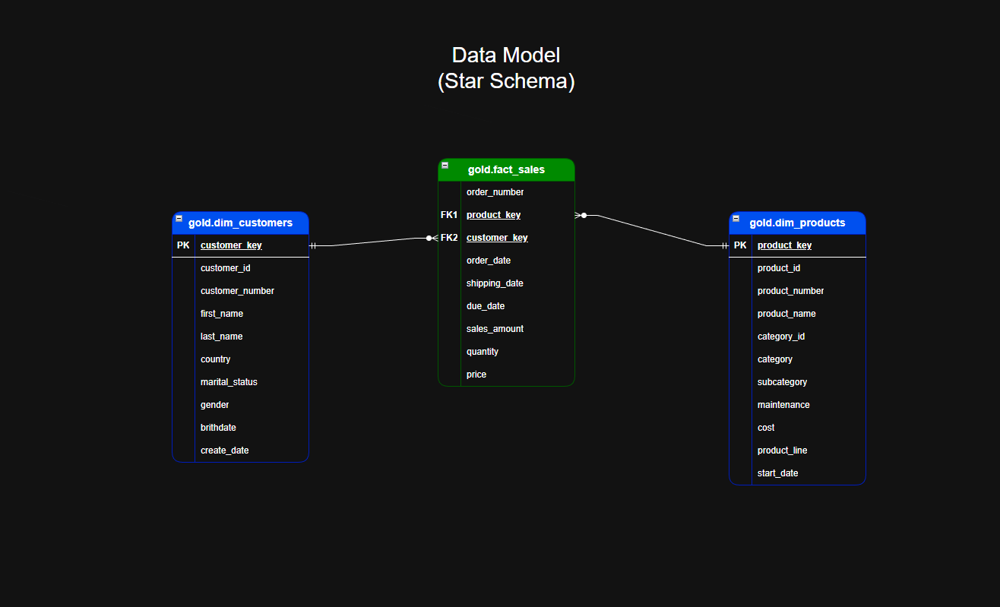

# 🧠 Data Warehouse & Analytics Solution

An end-to-end **Data Engineering & Analytics project** demonstrating the design and implementation of a modern **data warehouse** using SQL Server.

This solution showcases how raw data is ingested, transformed, and modeled into a **scalable, analytics-ready system** for business intelligence and reporting.

---

## 🔍 Project Overview

This project simulates a real-world data pipeline, transforming raw data from multiple sources into a structured and reliable analytical model.

It covers:
- Data architecture design  
- Data integration across multiple sources  
- ETL pipeline development  
- Dimensional data modeling (Star Schema)  
- Data quality validation  
- Analytical querying  

---

## 🏗️ Data Architecture

The solution follows the **Medallion Architecture (Bronze → Silver → Gold)**:

### 🔹 Layers

- **Bronze Layer (Raw Data)**  
  Stores raw data ingested from source systems (ERP & CRM) with minimal processing.

- **Silver Layer (Cleaned & Standardized)**  
  Applies data cleansing, validation, deduplication, and transformation.

- **Gold Layer (Business-Ready)**  
  Organizes data into a **star schema** (fact & dimension tables) optimized for analytics.

---

## 🔄 Data Flow

The pipeline follows a structured flow from ingestion to consumption:

1. **Data Ingestion**  
   - Raw data loaded from CSV files into Bronze tables  

2. **Data Transformation**  
   - Cleansing, standardization, and enrichment in Silver layer  

3. **Data Modeling**  
   - Business logic applied to create dimension and fact tables in Gold layer  

4. **Data Consumption**  
   - Final datasets are used for reporting, dashboards, and analysis  

---

## 🔗 Data Integration

This layer consolidates data from multiple operational systems into a unified model:

### Integrated Sources:
- **CRM System** → Customer and sales-related data  
- **ERP System** → Product, customer demographics, and reference data  

### Key Integration Concepts:
- Unified **customer view** combining CRM and ERP attributes  
- Standardized **product hierarchy** across systems  
- Consistent **business rules** applied across datasets  
- Alignment of keys across systems to enable seamless joins  

---

## 📐 Data Model (Star Schema)

The Gold layer is designed using a **Star Schema**:

### Components:

- **Dimension Tables**
  - `dim_customers`
  - `dim_products`

- **Fact Table**
  - `fact_sales`

### Design Principles:
- Surrogate keys for dimensional modeling  
- Fact table linked via foreign keys  
- Optimized for analytical queries and aggregations  

---

## ⚙️ Core Components

### 🛠️ Data Engineering
- Data ingestion from multiple sources (CSV)
- Data transformation and cleansing
- Layered data architecture implementation

### 📐 Data Modeling
- Star schema design (fact & dimension tables)
- Business rule implementation
- Historical data handling

### 📊 Analytics
- Customer behavior analysis  
- Product performance tracking  
- Sales trend analysis  

---

## 🎯 Business Value

This solution enables:

- 📈 **Data-Driven Decision Making**  
  Structured and reliable datasets for accurate insights  

- 🧹 **Improved Data Quality**  
  Validation and transformation pipelines reduce inconsistencies  

- ⚡ **Optimized Query Performance**  
  Star schema improves analytical efficiency  

- 🔗 **Single Source of Truth**  
  Unified view across CRM and ERP systems  

---

## 🧰 Tech Stack

| Category        | Technology              |
|----------------|------------------------|
| 🗄️ Database     | SQL Server             |
| 💬 Language     | T-SQL                  |
| 📁 Data Source  | CSV Files              |
| 🧱 Modeling     | Star Schema            |
| 🏗️ Architecture | Medallion Architecture |

---

## 🚀 Getting Started

1. Clone the repository  
2. Load datasets into SQL Server  
3. Execute scripts in sequence:
   - `bronze` → data ingestion  
   - `silver` → transformation & cleansing  
   - `gold` → data modeling  
4. Run analytical queries on Gold layer  

---

## 📈 Use Cases

This project demonstrates:

- End-to-end data engineering workflows  
- ETL pipeline design and implementation  
- Data warehouse architecture (Medallion)  
- Dimensional modeling (Star Schema)  
- SQL-based analytics  

---

## 🛡️ License

This project is licensed under the MIT License.  
You are free to use, modify, and distribute it with proper attribution.
