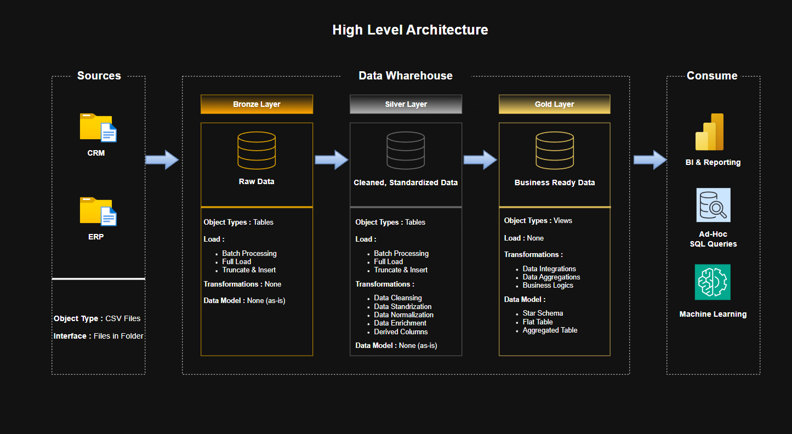

# 🧠 Data Warehouse & Analytics Solution

A complete end-to-end **Data Engineering and Analytics solution** focused on **building a modern data warehouse** using SQL Server.  
This project demonstrates how raw data is transformed into a scalable data warehouse and leveraged to generate actionable business insights.

---

## 🔍 Project Summary

This project demonstrates how to design and implement a **modern data pipeline**, starting from raw data ingestion to delivering analytics-ready datasets.

It covers:
- Data warehouse architecture design  
- ETL pipeline development  
- Dimensional data modeling  
- Analytical querying for business insights  

Built as a **portfolio project** to reflect real-world data workflows.

---

## 🏗️ Data Architecture

The solution follows the **Medallion Architecture**:



### 🔹 Layers Explained

- **Bronze Layer (Raw Data)**  
  Ingests data directly from ERP and CRM systems in its original format.

- **Silver Layer (Cleaned Data)**  
  Applies data cleaning, transformation, and standardization.

- **Gold Layer (Business Layer)**  
  Structures data into a **star schema** optimized for reporting and analytics.

---

## ⚙️ Core Components

### 🛠️ Data Engineering
- Extract data from multiple sources (CSV files)
- Transform and clean datasets
- Load structured data into SQL Server

### 📐 Data Modeling
- Build **fact and dimension tables**
- Design a **star schema** for performance and scalability

### 📊 Analytics
- Analyze key business areas:
  - Customer behavior  
  - Product performance  
  - Sales trends  

---

## 🎯 Business Impact

This project enables:

- 📈 **Improved Decision-Making**  
  Centralized and structured data supports accurate reporting  

- 🧹 **Enhanced Data Quality**  
  Data cleaning pipelines reduce inconsistencies and errors  

- ⚡ **Faster Analytics**  
  Optimized schema improves query performance  

- 🔗 **Unified Data View**  
  Combines ERP and CRM data into a single source of truth  

---

## 🧰 Tech Stack

| Category        | Tools / Technologies        |
|----------------|---------------------------|
| 🗄️ Database     | SQL Server                |
| 💬 Language     | T-SQL                     |
| 📁 Data Source  | CSV Files                 |
| 🧱 Modeling     | Star Schema               |
| 🏗️ Architecture | Medallion (Bronze/Silver/Gold) |

---

## 📂 Repository Structure
```
data-warehouse-project/
│
├── datasets/ # Source datasets (ERP & CRM)
├── docs/ # Documentation and diagrams
├── scripts/ # ETL and transformation scripts
│ ├── bronze/
│ ├── silver/
│ └── gold/
├── tests/ # Data quality and validation scripts
│
├── README.md
├── LICENSE
├── .gitignore
└── requirements.txt
```
---

## 🚀 Getting Started

1. Clone the repository  
2. Load datasets into SQL Server  
3. Execute scripts in order:
   - `bronze` → raw ingestion  
   - `silver` → transformation  
   - `gold` → analytical models  
4. Run analytical queries to explore insights  

---

## 📈 Use Cases

This project can be used to demonstrate:

- Data Engineering workflows  
- ETL pipeline design  
- Data warehousing concepts  
- SQL for analytics  
- Business Intelligence foundations  

---

## 🛡️ License

This project is licensed under the MIT License.  
You are free to use, modify, and distribute this project with proper attribution.
